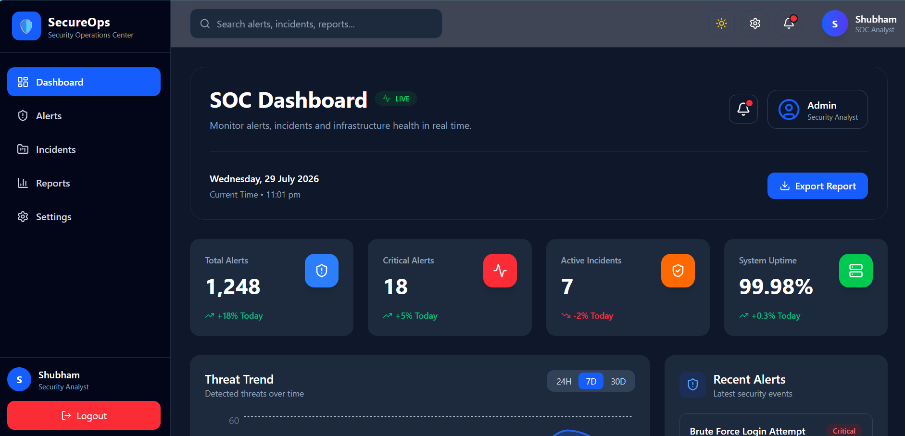
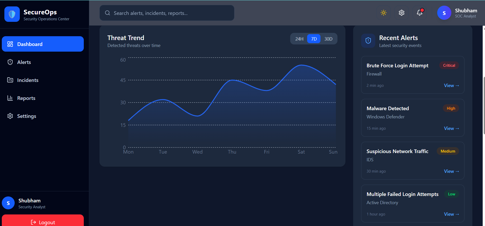
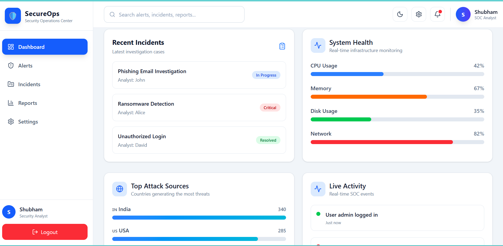

# 🛡️ SecureOps - SOC Dashboard

A modern Security Operations Center (SOC) Dashboard built with React, Tailwind CSS, and Recharts. The project was created to explore enterprise dashboard design, component architecture, dark mode, and cybersecurity-focused UI development.

---

## 📸 Preview




---

## ✨ Features

- Responsive Dashboard Layout
- Dark / Light Theme
- Professional Sidebar Navigation
- Dashboard Statistics Cards
- Weekly Threat Trend Chart
- Recent Security Alerts
- Recent Incidents
- System Health Monitoring
- Top Attack Sources
- Live Activity Feed
- Reusable UI Components
- Modern Glassmorphism-inspired Design

---

## 🛠️ Tech Stack

### Frontend

- React
- Vite
- Tailwind CSS
- React Router
- Recharts
- Lucide React
- Framer Motion (prepared for animations)

### State Management

- Context API
- Custom Hooks

---

## 📂 Project Structure

```
src/
│
├── components/
│   ├── dashboard/
│   ├── layout/
│   └── ui/
│
├── context/
│
├── pages/
│
├── hooks/
│
├── data/
│
└── assets/
```

---

## 🚀 Getting Started

Clone the repository

```bash
git clone https://github.com/iamshubham18/soc-dashboard.git
```

Install dependencies

```bash
npm install
```

Start development server

```bash
npm run dev
```

---

## 📌 Current Status

This project currently focuses on frontend dashboard development and UI architecture.

Implemented:

- Dashboard UI
- Responsive Layout
- Dark Mode
- Charts
- Modular Component Architecture
- Context API

Planned (Not Implemented):

- Backend Integration
- Authentication (JWT)
- Real-time Alerts
- Socket.IO
- Database
- Incident Management
- AI-powered Alert Analysis

---

## 🎯 Purpose

The primary objective of this project was to:

- Learn React architecture
- Build reusable UI components
- Practice Tailwind CSS
- Design a professional cybersecurity dashboard
- Explore enterprise dashboard layouts

---

## 📄 License

This project is available under the MIT License.

---

## 👨‍💻 Author

**Shubham**

GitHub: https://github.com/iamshubham18